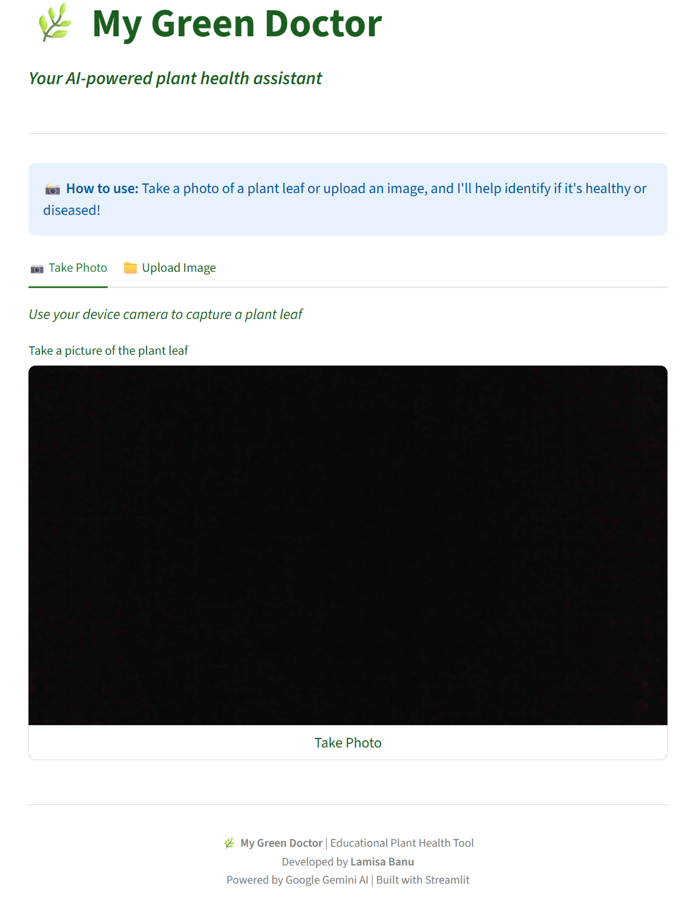
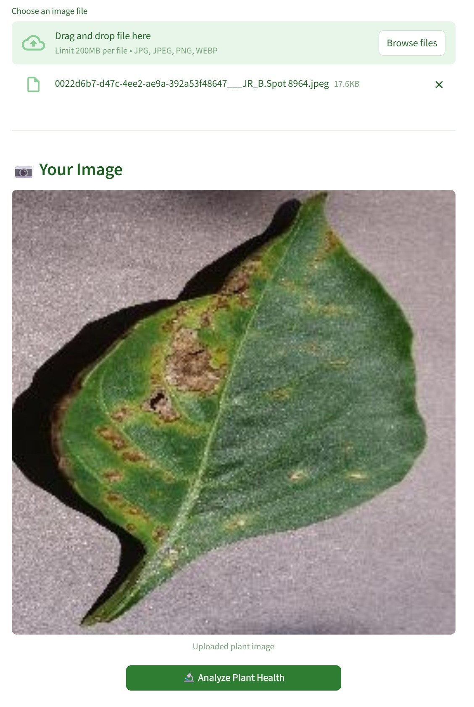
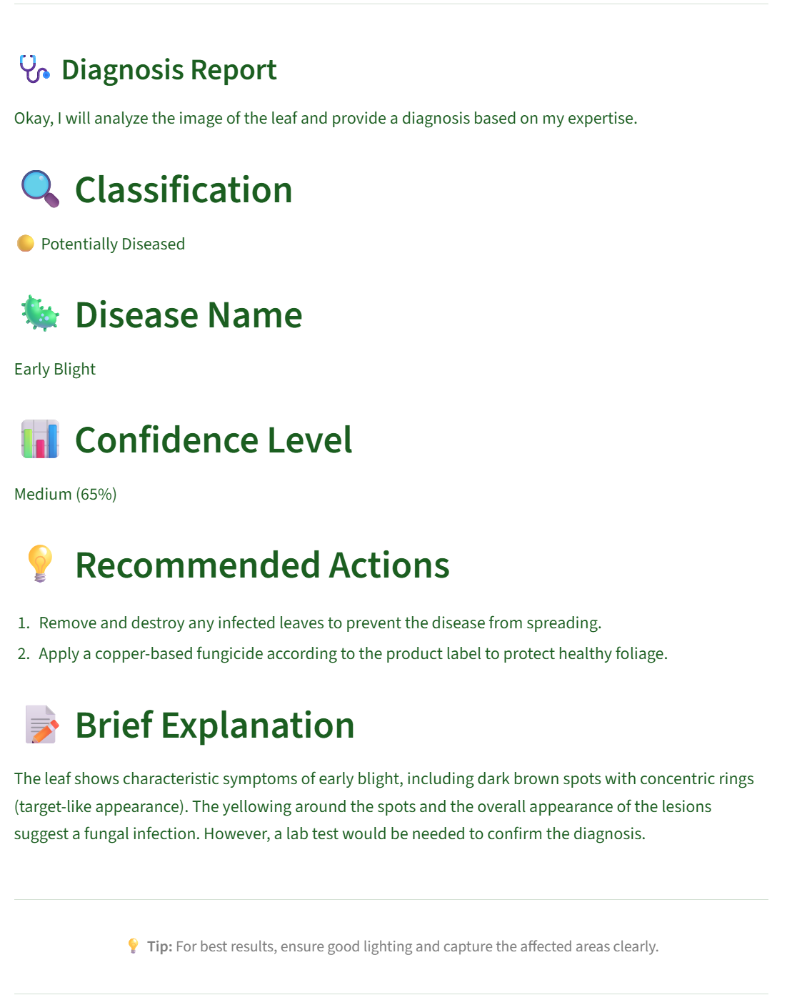

# 🌿 My Green Doctor

> **AI-Powered Plant Disease Detection for Education and Agriculture**

An educational web application that uses Artificial Intelligence to help farmers and students detect plant diseases from leaf photos using Google's Gemini Vision AI.

[](https://www.python.org/)
[](https://streamlit.io/)
[](LICENSE)

---

## 📋 Table of Contents

- [Project Overview](#project-overview)
- [Features](#features)
- [Technology Stack](#technology-stack)
- [Installation](#installation)
- [Usage](#usage)
- [Technical Architecture](#technical-architecture)
- [Configuration](#configuration)
- [Project Structure](#project-structure)
- [Development](#development)
- [Screenshots](#screenshots)
- [Contributing](#contributing)
- [License](#license)

---

## 🎯 Project Overview

**My Green Doctor** is a Science/Computer project developed by Lamisa Banu (8th standard student) for the academic year 2024-2025. The project demonstrates the practical application of Artificial Intelligence in agriculture, specifically for plant disease detection.

### Key Goals

- **Help Farmers**: Detect plant diseases early to reduce crop losses
- **Educational Tool**: Teach students about AI applications in agriculture
- **Social Impact**: Bridge the gap between technology and farming communities
- **Accessibility**: Make AI accessible to rural communities through a simple web interface

### Why This Project Matters

Plant diseases cause significant agricultural losses worldwide, especially affecting small-scale farmers who may not have easy access to agricultural experts. This project demonstrates how modern AI technology can be leveraged to create accessible tools that help farmers identify potential issues early.

---

## ✨ Features

### 📸 Image Input Methods

- **Camera Capture**: Take photos directly through the app using your device camera
- **File Upload**: Upload existing photos from your device gallery
- **Multiple Formats**: Supports JPG, JPEG, PNG, and WebP image formats

### 🤖 AI-Powered Analysis

- **Plant Health Classification**:
  - 🟢 Healthy
  - 🟡 Potentially Diseased
  - ⚪ Not a Plant

- **Disease Identification**: Identifies specific plant diseases when detected

- **Confidence Reporting**: Shows the AI's confidence level (High/Medium/Low)

- **Actionable Recommendations**: Provides practical tips for farmers and students

### 🎨 User Interface

- **Responsive Design**: Works seamlessly on mobile phones, tablets, and computers
- **Green-Themed**: Agriculture-appropriate color scheme
- **Simple Layout**: Easy-to-use interface designed for all age groups
- **Educational Explanations**: Clear, structured responses with detailed explanations

### ⚡ Technical Features

- **Image Optimization**: Automatic resizing and compression for faster processing
- **Error Handling**: Graceful handling of API errors and invalid inputs
- **Cost-Effective**: Uses free tier of Google Gemini AI
- **Privacy-First**: Images are not stored permanently

---

## 🛠 Technology Stack

### Backend & Framework

| Technology | Version | Purpose |
|------------|---------|---------|
| **Python** | 3.12+ | Core programming language |
| **Streamlit** | 1.28+ | Web application framework |
| **Google Generative AI** | 0.3.0+ | Gemini AI API integration |

### Image Processing

| Library | Version | Purpose |
|---------|---------|---------|
| **Pillow (PIL)** | 10.0.0+ | Image manipulation and optimization |

### AI Engine

| Component | Details |
|-----------|---------|
| **Model** | Google Gemini 2.0 Flash |
| **Type** | Vision-capable multimodal AI |
| **Features** | Fast, cost-effective, accurate image analysis |

---

## 🚀 Installation

### Prerequisites

Before you begin, ensure you have the following installed:

- **Python 3.12** or higher ([Download Python](https://www.python.org/downloads/))
- **pip** (Python package manager, included with Python)
- **Google Gemini API Key** ([Get free API key](https://makersuite.google.com/app/apikey))

### Step 1: Clone or Download the Project

```bash
# If cloning from a repository
git clone <repository-url>
cd lamisa-project

# Or if you have the project files, navigate to the project directory
cd /path/to/lamisa-project
```

### Step 2: Create a Virtual Environment

**Linux / macOS:**
```bash
python3 -m venv venv
source venv/bin/activate
```

**Windows:**
```bash
python -m venv venv
venv\Scripts\activate
```

### Step 3: Install Dependencies

```bash
pip install -r requirements.txt
```

This will install:
- `streamlit>=1.28.0`
- `google-generativeai>=0.3.0`
- `Pillow>=10.0.0`

### Step 4: Configure API Key

Create a `.streamlit/secrets.toml` file in your project root:

```bash
mkdir -p .streamlit
nano .streamlit/secrets.toml  # or use any text editor
```

Add your Google Gemini API key:

```toml
GEMINI_API_KEY = "your-actual-api-key-here"
```

**⚠️ Security Note:** Never commit your API key to version control! The `.streamlit/secrets.toml` file is already included in `.gitignore`.

---

## 🎮 Usage

### Starting the Application

Once everything is installed and configured:

```bash
streamlit run app.py
```

The application will start and open in your web browser at:
```
http://localhost:8501
```

### Using the App

1. **Open the App**: The app loads with a welcome screen
2. **Choose Input Method**:
   - Click "📷 Take Photo" to use your device camera
   - Click "📁 Upload Image" to upload an existing photo
3. **Provide Image**: Either capture or upload a plant leaf image
4. **Analyze**: Click the "🔬 Analyze Plant Health" button
5. **View Results**: The AI will provide a structured diagnosis report

### Example Workflow

```
┌─────────────────┐    ┌─────────────────┐    ┌─────────────────┐
│  Take/Upload    │ -> │  Click Analyze  │ -> │  View Diagnosis │
│  Plant Image    │    │  Button         │    │  Report         │
└─────────────────┘    └─────────────────┘    └─────────────────┘
```

### Best Practices for Accurate Results

- **Good Lighting**: Ensure the plant is well-lit
- **Focus**: Capture clear, focused images
- **Affected Areas**: Include any visible spots, discoloration, or damage
- **Single Leaf**: Frame one leaf or affected area at a time
- **Background**: Use simple backgrounds if possible

---

## 🏗 Technical Architecture

### System Flow Diagram

```
┌──────────────┐     ┌──────────────┐     ┌──────────────┐
│   User       │     │  Streamlit   │     │   Google     │
│   Browser    │────▶│   App        │────▶│   Gemini     │
│              │     │  (Python)    │     │     AI       │
└──────────────┘     └──────────────┘     └──────────────┘
                            │
                            ▼
                     ┌──────────────┐
                     │   Image      │
                     │  Processing  │
                     │   (PIL)      │
                     └──────────────┘
```

### Core Components

#### 1. **Main Application (`app.py`)**

The application is structured into four main sections:

- **Configuration**: Page setup, constants, and system prompts
- **Helper Functions**: API key validation, image processing, and analysis
- **User Interface**: Tabs, buttons, and display elements
- **Main Logic**: Orchestration of the user workflow

#### 2. **Image Processing Pipeline**

```python
Raw Image Input
       │
       ▼
┌──────────────────┐
│  Format Conversion│  (RGBA/PNG → RGB)
└──────────────────┘
       │
       ▼
┌──────────────────┐
│  Resize Check     │  (Max 800x800px)
└──────────────────┘
       │
       ▼
┌──────────────────┐
│  JPEG Compression│  (Quality: 85%)
└──────────────────┘
       │
       ▼
Optimized Image for API
```

#### 3. **AI Analysis Flow**

```python
User Image
       │
       ▼
┌──────────────────────────┐
│  System Prompt Injection  │  (Expert agricultural scientist)
└──────────────────────────┘
       │
       ▼
┌──────────────────────────┐
│  Gemini API Call          │  (gemini-2.0-flash)
└──────────────────────────┘
       │
       ▼
┌──────────────────────────┐
│  Structured Response      │  (Classification, Disease,
└──────────────────────────┘   Confidence, Recommendations)
```

### Key Technical Details

#### Image Optimization (app.py:74-98)

```python
MAX_IMAGE_SIZE = (800, 800)  # Maximum dimensions
JPEG_QUALITY = 85           # Compression quality
```

- **Purpose**: Reduce bandwidth and API costs
- **Method**: LANCZOS resampling algorithm for high-quality downscaling
- **Format Conversion**: Converts PNG with transparency to RGB

#### AI Configuration (app.py:120-123)

```python
generation_config=genai.types.GenerationConfig(
    temperature=0.3,        # Lower = more consistent results
    max_output_tokens=1024  # Response length limit
)
```

- **Temperature (0.3)**: Lower values produce more focused, deterministic outputs
- **Max Tokens (1024)**: Sufficient for detailed diagnosis without excessive cost

#### Error Handling (app.py:128-135)

The application handles three main error categories:

1. **API Key Errors**: Invalid or missing authentication
2. **Quota Errors**: Free tier usage limits exceeded
3. **Generic Errors**: Network issues, timeout, etc.

---

## ⚙️ Configuration

### Application Settings (.streamlit/config.toml)

```toml
[theme]
base = "light"
primaryColor = "#2E7D32"              # Forest green
backgroundColor = "#FFFFFF"            # White
secondaryBackgroundColor = "#E8F5E9"  # Light mint
textColor = "#1B5E20"                  # Dark green
font = "sans-serif"
```

### Environment Variables

| Variable | Description | Required |
|----------|-------------|----------|
| `GEMINI_API_KEY` | Google Gemini API key | Yes |

### Model Options

The app uses `gemini-2.0-flash` by default. Alternative models:

```python
# In app.py, line 112:
model = genai.GenerativeModel('gemini-2.0-flash')

# Alternatives:
# 'gemini-1.5-flash-latest' - Faster, less expensive
# 'gemini-pro-vision' - More accurate, slower
```

---

## 📁 Project Structure

```
lamisa-project/
├── app.py                          # Main application (247 lines)
├── requirements.txt                # Python dependencies
├── README.md                       # This file
├── .gitignore                      # Git exclusions
├── .python-version                 # Python version specification
│
├── .streamlit/
│   └── config.toml                 # UI theme configuration
│
├── venv/                           # Virtual environment (gitignored)
│
├── screenshots/                    # App screenshots
│   ├── 1.png                      # Home interface
│   ├── 2.jpg                      # Upload screen
│   └── 3.png                      # Diagnosis results
│
├── PROJECT_DOCUMENTATION.md        # Detailed project report
└── PROJECT_DOCUMENTATION.pdf       # PDF version of report
```

### File Descriptions

| File | Lines | Purpose |
|------|-------|---------|
| `app.py` | 247 | Core application logic and UI |
| `requirements.txt` | 15 | Python package dependencies |
| `.streamlit/config.toml` | 17 | UI theme and appearance settings |
| `.gitignore` | 32 | Files to exclude from version control |

---

## 🔧 Development

### Running in Development Mode

```bash
# Activate virtual environment
source venv/bin/activate  # Linux/Mac
# or
venv\Scripts\activate     # Windows

# Run the app
streamlit run app.py

# Run on custom port
streamlit run app.py --server.port 8080

# Run with auto-reload
streamlit run app.py --server.runOnSave true
```

### Code Structure

The application follows a clean, modular structure:

```python
# 1. Configuration (lines 17-54)
st.set_page_config(...)
MAX_IMAGE_SIZE = (800, 800)
SYSTEM_PROMPT = """..."""

# 2. Helper Functions (lines 57-135)
check_api_key()
resize_image()
image_to_bytes()
analyze_plant_image()

# 3. Main UI (lines 142-238)
def main():
    # Header
    # API Key Check
    # Image Input Tabs
    # Analysis & Display
    # Footer

# 4. Entry Point (lines 245-246)
if __name__ == "__main__":
    main()
```

### Adding New Features

To add a new feature to the analysis prompt, modify the `SYSTEM_PROMPT` constant (line 33):

```python
SYSTEM_PROMPT = """...
## 🔬 Additional Analysis
[Add your new section here]
"""
```

### Testing

Test the application with different image types:

```bash
# Test with healthy plants
python -c "from PIL import Image; Image.open('test_healthy.jpg')"

# Test with diseased plants
python -c "from PIL import Image; Image.open('test_diseased.jpg')"

# Test with non-plant images
python -c "from PIL import Image; Image.open('test_nonplant.jpg')"
```

---

## 📸 Screenshots

<div align="center">

### Home Interface


### Upload Screen


### Diagnosis Results


</div>

---

## 🤝 Contributing

Contributions are welcome! This is an educational project, and improvements help students learn.

### How to Contribute

1. Fork the repository
2. Create a feature branch (`git checkout -b feature/amazing-feature`)
3. Make your changes
4. Commit your changes (`git commit -m 'Add amazing feature'`)
5. Push to the branch (`git push origin feature/amazing-feature`)
6. Open a Pull Request

### Contribution Ideas

- **New Disease Database**: Expand the AI's knowledge with more plant diseases
- **Multi-language Support**: Add translations for different languages
- **Offline Mode**: Implement local AI models for offline functionality
- **History Tracking**: Save and display past analyses
- **Crop-Specific Models**: Specialized models for different crop types
- **Mobile App**: Native Android/iOS application
- **SMS Integration**: Send results via SMS for areas with limited internet

### Code Style

- Follow PEP 8 guidelines for Python code
- Add docstrings to functions
- Keep functions focused and modular
- Use descriptive variable names

---

## 📊 Limitations and Future Improvements

### Current Limitations

1. **Educational Use Only**: Not a replacement for professional diagnosis
2. **Internet Required**: Needs active internet connection for AI analysis
3. **API Quotas**: Free tier has usage limits
4. **Image Quality Dependent**: Accuracy depends on photo quality
5. **Limited to Visual Diagnosis**: Cannot detect internal or soil-borne diseases

### Future Improvements

- [ ] Integration with local agricultural databases
- [ ] Multi-language support for regional accessibility
- [ ] Offline capability with local AI models
- [ ] Treatment suggestions and product recommendations
- [ ] Disease severity scoring
- [ ] Historical tracking and trend analysis
- [ ] Integration with weather data for disease prediction

---

## 🧪 Testing the Application

### Test Scenarios

1. **Healthy Plant Test**
   - Upload a healthy leaf image
   - Expected: Classification shows "🟢 Healthy"

2. **Diseased Plant Test**
   - Upload a leaf with visible disease symptoms
   - Expected: Classification shows "🟡 Potentially Diseased" with disease name

3. **Non-Plant Test**
   - Upload an image without plants
   - Expected: Classification shows "⚪ Not a Plant"

4. **API Error Test**
   - Run with invalid API key
   - Expected: Clear error message displayed

---

## 📚 Resources

- [Streamlit Documentation](https://docs.streamlit.io/)
- [Google Generative AI Documentation](https://ai.google.dev/docs)
- [Google AI Studio](https://makersuite.google.com/)
- [Pillow Documentation](https://pillow.readthedocs.io/)

---

## 👨‍🎓 About the Developer

**Lamisa Banu** is an 8th standard student with a passion for using technology to solve real-world problems. This project was developed for the academic year 2024-2025 as a Science/Computer project demonstrating the practical application of AI in agriculture.

### Project Vision

> "To bridge the gap between cutting-edge technology and traditional farming, creating tools that are accessible, educational, and impactful for rural communities."

---

## ⚠️ Disclaimer

**IMPORTANT**: This application is for **EDUCATIONAL PURPOSES ONLY**.

- The AI analysis should **NOT** replace professional agricultural advice
- Always consult with a local agricultural extension officer or plant pathologist for accurate diagnosis
- The recommendations provided are general guidelines and may not be suitable for all situations
- Crop treatment decisions should be made based on professional assessment

---

## 📜 License

This project is developed as an educational science project. Please contact the developer for usage permissions.

```
Educational Project - My Green Doctor
Copyright (c) 2024-2025 Lamisa Banu

This project is for educational and demonstration purposes.
```

---

## 📞 Support

For questions, suggestions, or collaboration:

- **Project Website**: [Add URL if deployed]
- **Documentation**: See `PROJECT_DOCUMENTATION.md`
- **Issues**: [Create an issue on GitHub](../../issues)

---

## 🌟 Acknowledgments

- **Google AI** for providing the Gemini AI API
- **Streamlit** for the excellent web framework
- **Open Source Community** for invaluable learning resources

---

<div align="center">

**Made with 💚 for farmers and students**

**🌿 My Green Doctor - Your AI-Powered Plant Health Assistant 🌿**

</div>